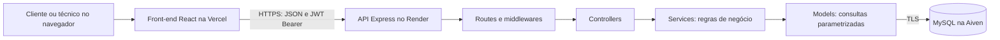

# Plano de implementação — HelpDesk API e Front-end

Data: 03/09/2026. Plano de referência aprovado. A implementação local foi realizada; consulte STATUS_IMPLEMENTACAO.md para as verificações executadas e a etapa de publicação.

## 1. Objetivo e escopo

Entregar a Aplicação 2 da recuperação trimestral: um sistema de abertura e atendimento de chamados, com API REST e front-end independentes, persistência em banco gerenciado e publicação em produção.

O EventHub já foi realizado e está fora deste trabalho.

Repositórios identificados no ambiente:

- Back-end: https://github.com/BeFinkler/HelpDeskAPIBack
- Front-end: https://github.com/BeFinkler/HelpDeskAPIFront

Ambos contêm somente um README inicial. O ambiente local possui Node.js 24.14.0 e npm 11.9.0. Cada repositório terá instalação, configuração, execução, testes e deploy próprios.

## 2. Decisões técnicas

| Camada          | Escolha                                                    | Motivo e aplicação                                                                                                       |
| --------------- | ---------------------------------------------------------- | ------------------------------------------------------------------------------------------------------------------------ |
| Linguagem       | JavaScript com módulos ES e JSDoc                          | Alinhamento ao ecossistema estudado e documentação explícita das responsabilidades.                                      |
| Runtime         | Node.js 24 LTS                                             | Mesma versão principal no desenvolvimento, CI e Render; fixar uma versão de manutenção compatível na implementação.      |
| API             | Express                                                    | Rotas JSON, middlewares, autenticação e tratamento central de erros.                                                     |
| Banco           | MySQL gerenciado na Aiven                                  | Modelo relacional com chaves estrangeiras e conexão TLS com verificação de certificado.                                  |
| Acesso ao banco | mysql2/promise                                             | Pool de conexões, transações e prepared statements com execute(sql, parametros).                                         |
| Configuração    | dotenv e validação do ambiente                             | Credenciais, portas e URLs externas carregadas de variáveis; falhar na inicialização se faltar configuração obrigatória. |
| Autenticação    | bcryptjs e jsonwebtoken                                    | Hash de senhas e JWT enviado por Authorization: Bearer.                                                                  |
| Proteção HTTP   | cors, helmet e express-rate-limit                          | Origem do front-end permitida, cabeçalhos de segurança e limite de tentativas de autenticação.                           |
| Validação       | express-validator                                          | Validação e normalização em middlewares, antes dos controllers.                                                          |
| Documentação    | OpenAPI 3.0 e swagger-ui-express                           | Especificação versionada e interface pública em /api-docs.                                                               |
| Interface       | React + Vite + React Router                                | Aplicação no navegador com páginas, componentes e consumo assíncrono via fetch.                                          |
| Estilos         | CSS próprio responsivo                                     | Interface consistente em português, adaptada a computador e celular.                                                     |
| Verificação     | node:test + Supertest; Playwright para os fluxos completos | Testar regras reais, isolamento entre usuários, integração MySQL e uso pelo navegador.                                   |
| Nuvem           | Render + Vercel + Aiven                                    | API, cliente Web e banco em serviços separados, conforme os serviços recomendados pelo professor.                        |

As versões exatas das dependências serão verificadas e fixadas pelo package-lock.json ao iniciar a implementação. O status de suporte do Node será conferido na [documentação oficial](https://nodejs.org/en/about/previous-releases).

O mysql2 oferece execute para prepared statements, que será o padrão das operações com dados de entrada. [Documentação do mysql2](https://sidorares.github.io/node-mysql2/docs/examples/queries/prepared-statements).

## 3. Arquitetura e responsabilidades



O front-end conhece apenas a URL pública da API. Os dados e as permissões são controlados pelo back-end. A API não renderiza as telas do sistema; a interface HTML de documentação em /api-docs é uma exceção técnica prevista no enunciado.

Estrutura prevista do back-end:

```text
src/
  app.js
  server.js
  config/             # dotenv, ambiente, conexão e segurança
  routes/             # auth e chamados
  controllers/        # entrada HTTP e resposta JSON; JSDoc obrigatório
  services/           # autenticação, permissões e transições de status
  models/             # usuários, chamados e comentários
  middlewares/        # autenticação, autorização, validação e erros
  validators/         # regras de body, params e query
  errors/             # erros de aplicação com código HTTP
  docs/               # especificação OpenAPI e configuração Swagger
database/
  migrations/         # alterações numeradas do esquema
scripts/              # migrações e criação controlada de técnico
tests/
  unit/
  integration/
docs/
.github/workflows/
.env.example
.gitignore
package.json
package-lock.json
README.md
```

Usar injeção de dependências por funções de criação: o ponto de composição monta pool → models → services → controllers. As rotas recebem os controllers. app.js permite montar a aplicação para testes sem abrir uma porta; server.js valida o ambiente, conecta ao banco e inicia o servidor. Não é necessário um contêiner de injeção externo.

Estrutura prevista do front-end:

```text
src/
  main.jsx
  App.jsx
  routes/             # rotas públicas, privadas e por perfil
  pages/              # login, cadastro, painel, lista, abertura e detalhes
  components/         # formulários, filtros, tabelas, estados e navegação
  contexts/           # autenticação
  hooks/              # carregamento de dados e operações de interface
  services/           # cliente HTTP e funções de acesso à API
  utils/              # datas, rótulos e validações de interface
  styles/             # identidade visual, componentes e responsividade
public/
tests/e2e/
docs/
.github/workflows/
.env.example
.gitignore
vercel.json
package.json
package-lock.json
README.md
```

## 4. Perfis e regras de negócio

| Operação                                         | Cliente                               | Técnico                                                 |
| ------------------------------------------------ | ------------------------------------- | ------------------------------------------------------- |
| Cadastro público                                 | Cria conta de cliente                 | Conta criada por comando administrativo no servidor     |
| Listagem e indicadores                           | Apenas chamados próprios              | Todos os chamados da central                            |
| Abrir chamado                                    | Sim, associado ao usuário autenticado | Não nesta versão                                        |
| Editar título, descrição, categoria e prioridade | Somente chamado próprio ainda Aberto  | Não altera o relato original                            |
| Ler detalhes e comentários                       | Somente chamados próprios             | Todos os chamados da central                            |
| Assumir atendimento                              | Não                                   | Sim, se o chamado estiver Aberto e sem responsável      |
| Comentar                                         | No próprio chamado não concluído      | No chamado que assumiu e ainda não concluiu             |
| Concluir atendimento                             | Não                                   | Somente o técnico responsável, com descrição da solução |
| Consultar histórico concluído                    | Chamados próprios                     | Todos os chamados                                       |

Regras fundamentais:

1. Cadastro público aceita nome, e-mail e senha. O servidor determina perfil cliente. Tentativas de enviar perfil técnico ou outros campos privilegiados serão rejeitadas.
2. Contas de técnicos serão criadas por comando explícito com credenciais fornecidas pelo ambiente. Nenhuma senha padrão será colocada no código, README ou GitHub.
3. Quem abre um chamado é identificado pelo JWT. cliente_id enviado pelo navegador não será aceito.
4. Todo chamado começa Aberto, sem técnico responsável.
5. Assumir um chamado atribui o técnico autenticado e muda o status para Em Atendimento na mesma transação.
6. Somente o responsável pode concluir. A conclusão exige solução registrada e grava a data de encerramento.
7. Concluído representa o encerramento pedido pelo professor. Não haverá um quarto status chamado Encerrado.
8. Chamados concluídos ficam disponíveis para consulta, com campos e comentários bloqueados para alteração.
9. A versão inicial não terá exclusão de chamados nem reabertura: o fluxo exigido preserva o histórico e termina na conclusão. O enunciado não exige DELETE para HelpDesk.
10. Dois técnicos tentando assumir o mesmo chamado simultaneamente não podem ambos obter sucesso: uma operação vence e a outra recebe conflito HTTP 409.
11. Campos controlados pelo servidor, como responsável, datas, autor e status inicial, não podem ser sobrescritos por um objeto enviado pelo cliente.

Fluxo autorizado:

```text
ABERTO → EM_ATENDIMENTO → CONCLUIDO
         técnico assume   responsável informa a solução
```

Os códigos acima serão os valores JSON; a interface e o Swagger explicarão os rótulos literais Aberto, Em Atendimento e Concluído.

## 5. Modelo de dados

As três tabelas obrigatórias serão implementadas com InnoDB, utf8mb4, chaves estrangeiras e datas gravadas em UTC.

### usuarios

| Campo                     | Finalidade                                                 |
| ------------------------- | ---------------------------------------------------------- |
| id                        | Chave primária numérica gerada pelo banco.                 |
| nome                      | Nome de exibição, até 100 caracteres.                      |
| email                     | E-mail normalizado, até 254 caracteres, com índice UNIQUE. |
| senha_hash                | Hash bcrypt; nunca retornado pela API.                     |
| perfil                    | Enum cliente ou tecnico.                                   |
| criado_em / atualizado_em | Datas de criação e alteração.                              |

### chamados

| Campo                      | Finalidade                                                                         |
| -------------------------- | ---------------------------------------------------------------------------------- |
| id                         | Chave primária, também usada no protocolo visual HD-000123.                        |
| titulo                     | Resumo com até 160 caracteres.                                                     |
| descricao                  | Relato do problema, limitado a 5.000 caracteres na API.                            |
| categoria                  | acesso, hardware, software, rede ou outros.                                        |
| prioridade                 | baixa, media ou alta.                                                              |
| status                     | ABERTO, EM_ATENDIMENTO ou CONCLUIDO.                                               |
| cliente_id                 | Chave estrangeira obrigatória para o solicitante.                                  |
| tecnico_id                 | Chave estrangeira opcional, preenchida ao assumir.                                 |
| resolucao                  | Solução informada pelo técnico na conclusão; até 5.000 caracteres.                 |
| versao                     | Inteiro incrementado nas alterações para detectar edição com dados desatualizados. |
| criado_em / atualizado_em  | Datas de criação e última alteração.                                               |
| iniciado_em / concluido_em | Datas que registram o ciclo de atendimento.                                        |

### comentarios_chamado

| Campo      | Finalidade                                               |
| ---------- | -------------------------------------------------------- |
| id         | Chave primária.                                          |
| chamado_id | Chave estrangeira do chamado.                            |
| usuario_id | Autor, obtido da autenticação.                           |
| mensagem   | Texto simples entre 1 e 2.000 caracteres após validação. |
| criado_em  | Data de publicação.                                      |

Relações: um cliente abre muitos chamados; um técnico atende muitos chamados; um chamado possui muitos comentários; cada comentário pertence a um usuário e a um chamado.

Criar índices para cliente/status/data, técnico/status/data e chamado/data dos comentários, além do e-mail único. As consultas e a necessidade de índices adicionais serão revistas conforme os filtros implementados.

Migrações serão versionadas e registradas em uma tabela técnica schema_migrations. O executor deverá lidar com reexecução sem recriar dados; como DDL no MySQL pode realizar commits implícitos, falhas de migração devem ser identificadas e corrigidas explicitamente. Nunca executar recriação destrutiva automática do banco em produção.

Usar transações na atribuição de técnico, conclusão e publicação de comentários. Bloquear a linha do chamado durante a verificação e gravação, impedindo que um comentário seja inserido depois de uma conclusão concorrente. Atualizações de conteúdo e status também validarão a versao recebida.

## 6. Contrato HTTP da API

Prefixo das rotas de negócio: /api/v1. JSON em requisições e respostas. Datas no formato ISO 8601 UTC.

| Método e rota                         | Autorização                 | Comportamento                                                       |
| ------------------------------------- | --------------------------- | ------------------------------------------------------------------- |
| POST /api/v1/auth/cadastro            | Pública, limitada por taxa  | Cadastra cliente e responde 201 com dados públicos.                 |
| POST /api/v1/auth/login               | Pública, limitada por taxa  | Valida senha e responde com token, expiração e usuário.             |
| GET /api/v1/auth/me                   | JWT                         | Retorna usuário atual sem hash.                                     |
| GET /api/v1/chamados/resumo           | JWT                         | Contagens por status respeitando o alcance do perfil.               |
| GET /api/v1/chamados                  | JWT                         | Lista paginada com filtros e busca.                                 |
| POST /api/v1/chamados                 | Cliente                     | Abre chamado e responde 201.                                        |
| GET /api/v1/chamados/:id              | Proprietário ou técnico     | Exibe chamado, participantes e informações do atendimento.          |
| PATCH /api/v1/chamados/:id            | Cliente proprietário        | Edita os campos permitidos enquanto Aberto; exige versao.           |
| PATCH /api/v1/chamados/:id/status     | Técnico autorizado          | Assume ou conclui conforme a transição solicitada; exige versao.    |
| GET /api/v1/chamados/:id/comentarios  | Proprietário ou técnico     | Retorna comentários paginados em ordem cronológica.                 |
| POST /api/v1/chamados/:id/comentarios | Proprietário ou responsável | Publica comentário no chamado não concluído e responde 201.         |
| GET /health                           | Pública                     | Confirma processo vivo, sem informações sensíveis.                  |
| GET /health/ready                     | Pública                     | Testa acesso ao banco; 200 quando pronto e 503 quando indisponível. |
| GET /api-docs                         | Pública                     | Swagger UI com botão Authorize.                                     |
| GET /api-docs.json                    | Pública                     | Especificação OpenAPI.                                              |

Registrar /chamados/resumo antes de /chamados/:id para evitar que resumo seja interpretado como identificador.

Filtros: status, categoria, prioridade e busca por título/protocolo. Técnicos terão também filtro de chamados atribuídos a si. pagina começa em 1; limite padrão 20 e máximo 100. Ordenação por data e id com critérios permitidos explicitamente; nunca interpolar um nome de coluna recebido do usuário em SQL.

Envelope de sucesso:

```json
{
  "data": [],
  "meta": { "pagina": 1, "limite": 20, "total": 0, "totalPaginas": 0 }
}
```

Envelope de erro:

```json
{
  "error": {
    "code": "VALIDATION_ERROR",
    "message": "Revise os campos informados.",
    "fields": [{ "field": "titulo", "message": "Informe o título do chamado." }]
  }
}
```

Padronizar 400 para JSON ou parâmetros malformados, 401 para autenticação ausente/inválida/expirada, 403 para ação proibida ao perfil, 404 para recurso inexistente ou chamado de outro cliente, 409 para conflito de e-mail/estado/versão, 422 para campos inválidos e 429 para limite de tentativas. Erros inesperados respondem 500 com mensagem genérica. Erros esperados de indisponibilidade podem responder 503, conforme o contrato.

## 7. Segurança e configuração

- dotenv no processo Node; validar tipos, portas, URLs e segredos antes de aceitar requisições. .env fica no .gitignore; .env.example contém somente exemplos e campos vazios para segredos.
- Hash bcrypt com custo inicial 12. Validar senha com mínimo de 8 caracteres e máximo de 72 bytes em UTF-8 para não aceitar truncamento silencioso. Não aplicar trim ou outras alterações à senha.
- JWT assinado com segredo forte do ambiente, prazo inicial de 1 hora, algoritmo permitido fixado e validação de emissor, audiência e expiração. Não incluir senhas ou dados desnecessários no token.
- Middleware carrega o usuário autenticado e verifica perfil e propriedade no servidor em todas as rotas privadas, inclusive detalhes, comentários e indicadores.
- Front-end guarda o token em sessionStorage para sobreviver ao recarregamento da aba. Esse armazenamento é acessível ao JavaScript: usar texto escapado, política CSP e evitar HTML arbitrário. Ele não oferece a proteção httpOnly de um cookie.
- Logout remove o token e os dados privados da interface. Nesta estratégia JWT sem revogação, uma cópia já emitida continua válida até expirar; não prometer invalidação imediata no servidor. Ao expirar, solicitar novo login.
- Todas as queries com valores de usuário usam prepared statements; montar filtros somente por fragmentos SQL internos permitidos e parâmetros separados.
- Validar body, params e query: IDs inteiros positivos, enums, tamanhos, paginação e campos aceitos. Aplicar trim em textos apropriados e normalização de e-mail sem alterar arbitrariamente o conteúdo de senhas ou relatos.
- Textos de chamados e comentários serão tratados como texto simples e renderizados com escape pelo React; não usar dangerouslySetInnerHTML.
- Limitar tamanho dos corpos JSON; aplicar limite de tentativas de login/cadastro e cabeçalhos de segurança.
- Controllers assíncronos usam try/catch e encaminham falhas ao middleware central; logs não incluem senha, token, credenciais de conexão ou corpos sensíveis. Respostas de produção não incluem stack trace nem SQL interno.
- Configurar proxy confiável conforme a infraestrutura do Render para que rate limiting considere o IP correto sem confiar indiscriminadamente em cabeçalhos enviados pelo cliente.
- Pool MySQL com limite configurável, timeout, transações com rollback e fechamento das conexões no encerramento do processo.
- TLS obrigatório para banco em nuvem, com CA e verificação de certificado; não usar rejectUnauthorized: false em produção. A Aiven orienta configurar a CA obtida no painel. [Documentação Aiven](https://aiven.io/docs/products/mysql/howto/connect-from-mysql-workbench).

### Política de CORS e Swagger

FRONTEND_URL representa uma origem exata, incluindo protocolo e porta quando necessária. Em desenvolvimento, será a origem local do Vite; em produção, o domínio estável da aplicação Vercel. Não liberar asterisco, todo o domínio vercel.app ou localhost na configuração de produção.

Permitir Content-Type e Authorization e responder corretamente ao preflight OPTIONS. Como a autenticação usa Bearer e não cookies entre domínios, credentials não precisa ser habilitado.

O Swagger será servido pela própria API e utilizará URL de servidor relativa. As requisições da documentação são da mesma origem; a validação de origem deve preservar esse uso sem habilitar CORS para uma segunda aplicação. Requisições sem Origin, como ferramentas HTTP e health checks, continuam sujeitas à autenticação quando a rota for privada.

CORS governa leitura de respostas no navegador; o controle de acesso é feito por JWT e autorização, inclusive para clientes externos como Postman. [Documentação do middleware cors](https://expressjs.com/en/resources/middleware/cors/).

### Variáveis previstas

| Back-end                                                                 | Uso                                                                                             |
| ------------------------------------------------------------------------ | ----------------------------------------------------------------------------------------------- |
| NODE_ENV                                                                 | development, test ou production.                                                                |
| PORT                                                                     | Porta do servidor; usar a fornecida pelo Render.                                                |
| FRONTEND_URL                                                             | Origem exata permitida pelo CORS.                                                               |
| API_PUBLIC_URL                                                           | Origem exata da API para preservar o uso do Swagger na mesma origem.                            |
| DB_HOST, DB_PORT, DB_NAME, DB_USER, DB_PASSWORD                          | Conexão MySQL fornecida pelo ambiente.                                                          |
| DB_SSL                                                                   | Ativar TLS; obrigatório em produção.                                                            |
| DB_SSL_CA_BASE64                                                         | Conteúdo da CA codificado para transporte em variável; decodificar no servidor.                 |
| DB_POOL_LIMIT                                                            | Limite de conexões compatível com o plano do banco.                                             |
| JWT_SECRET                                                               | Segredo de assinatura, sem valor padrão.                                                        |
| JWT_EXPIRES_IN                                                           | Expiração inicial 1h, validada.                                                                 |
| JWT_ISSUER, JWT_AUDIENCE                                                 | Identificadores esperados no token.                                                             |
| BCRYPT_ROUNDS                                                            | Custo do hash; inicial 12.                                                                      |
| TRUST_PROXY                                                              | Configuração validada para o proxy do ambiente.                                                 |
| SETUP_TECHNICIAN_NAME, SETUP_TECHNICIAN_EMAIL, SETUP_TECHNICIAN_PASSWORD | Somente para o comando de criação controlada de técnico.                                        |
| TEST_DB_NAME                                                             | Banco isolado para testes de integração; nunca apontar testes destrutivos ao banco de produção. |

| Front-end    | Uso                                                                                          |
| ------------ | -------------------------------------------------------------------------------------------- |
| VITE_API_URL | URL pública completa do prefixo da API, por exemplo a origem de produção seguida de /api/v1. |

O dicionário definitivo deverá acompanhar cada .env.example e README. O front-end usa import.meta.env do Vite; dotenv/process.env é utilizado no Node. Variáveis VITE_ são expostas ao navegador e não podem conter senha, segredo JWT ou conexão de banco. [Documentação Vite](https://vite.dev/guide/env-and-mode).

## 8. Telas e experiência do usuário

1. Login: e-mail, senha, mostrar/ocultar senha, carregamento, mensagem de credenciais inválidas e link para cadastro.
2. Cadastro: nome, e-mail, senha e confirmação; criação exclusiva de cliente e redirecionamento ao login após sucesso.
3. Painel: contagens reais por status; identificação do perfil; atalhos para abrir chamado ou acessar fila, conforme a permissão.
4. Lista de chamados: protocolo, título, status, prioridade, categoria, solicitante/responsável quando pertinente e data; filtros, busca, paginação e estado vazio.
5. Abertura: título, descrição, categoria e prioridade; validação, prevenção de envio duplicado pela interface e redirecionamento aos detalhes.
6. Detalhes: relato, participantes, datas, status, solução e comentários com autor e horário; cliente pode editar enquanto Aberto; técnico pode assumir e concluir conforme as regras.
7. Conclusão: formulário que exige descrição da solução e confirmação explícita do usuário antes de enviar a operação.
8. Estados de navegação: carregamento, acesso negado, sessão expirada, chamado não encontrado, página inexistente e API indisponível.

Usar layout com navegação consistente, cores de status acompanhadas de texto, labels associados a inputs, foco visível, navegação por teclado e mensagens de erro junto aos campos. Modal, caso usado, terá foco controlado e retorno ao acionador. Datas serão formatadas em pt-BR, sem modificar o valor UTC recebido.

Centralizar fetch: montar a URL, enviar Bearer, interpretar JSON/erros, lidar com respostas não JSON do provedor, cancelar requisições obsoletas e tratar 401. Evitar repetição automática de POST/PATCH após falha de rede, pois a operação pode já ter sido gravada. Recarregar os dados após alterações e invalidar os indicadores afetados.

Uma falha de conexão não deve aparecer como lista vazia nem como sucesso. Filtros e buscas devem ignorar respostas antigas que cheguem fora de ordem.

## 9. Etapas de execução e critérios de aceite

| Etapa                              | Como será feita                                                                                                                                                      | Critério para considerar pronta                                                                                                                                                                                 |
| ---------------------------------- | -------------------------------------------------------------------------------------------------------------------------------------------------------------------- | --------------------------------------------------------------------------------------------------------------------------------------------------------------------------------------------------------------- |
| 1. Fundamentos e contrato          | Criar package.json, scripts, estrutura de camadas, .gitignore, .env.example, lint e contrato OpenAPI inicial; registrar regras e modelo relacional.                  | Cada repositório instala separadamente; configuração faltante gera mensagem clara; contrato inicial cobre as operações planejadas.                                                                              |
| 2. Banco e prova de infraestrutura | Implementar pool, TLS, migrações e health checks; preparar um cliente mínimo para validar origem; conectar Aiven, Render e Vercel assim que houver acesso às contas. | Migrações executam em banco isolado e remoto; /health/ready comprova conexão; front-end publicado alcança a API com a origem permitida. Se faltar acesso, registrar a dependência e continuar as etapas locais. |
| 3. Autenticação e permissões       | Implementar cadastro, login, me, hash, JWT, validação e comando de criação do técnico; injetar dependências.                                                         | Senha fica em hash; cadastro não promove a técnico; JWT inválido/expirado é recusado; dados privados não aparecem nas respostas.                                                                                |
| 4. Chamados e comentários          | Implementar models, services, controllers, filtros, paginação, resumo, edição e transições atômicas.                                                                 | Cliente A não acessa chamado de B; técnico assume e conclui; comentários obedecem às regras; concorrência não causa dupla atribuição.                                                                           |
| 5. Documentação da API             | Completar OpenAPI junto às rotas; documentar controllers com @async, @param, @returns e @throws, descrevendo também o encaminhamento ao middleware de erros.         | /api-docs permite login, Authorize e operações reais; schemas, exemplos e códigos de erro correspondem à API.                                                                                                   |
| 6. Interface e autenticação        | Criar componentes visuais, rotas, cliente HTTP, login, cadastro, contexto e navegação por perfil.                                                                    | Usuário real autentica; recarregar preserva a sessão da aba; logout limpa os dados; 401 encaminha ao login.                                                                                                     |
| 7. Fluxo completo no navegador     | Implementar painel, lista, abertura, edição, detalhes, comentários, atendimento e conclusão sobre a API real.                                                        | Um cliente abre, um técnico atende e conclui, e o cliente consulta a solução e o histórico persistidos.                                                                                                         |
| 8. Verificação e acabamento        | Executar testes de regras, integração MySQL, contrato e fluxos de navegador; revisar responsividade, acessibilidade, erros e segurança.                              | Fluxos críticos e negativos passam; build de produção funciona; nenhuma operação expõe dados de outro cliente.                                                                                                  |
| 9. Publicação e homologação        | Aplicar migrações pendentes, configurar variáveis e CA, publicar versões finais, testar CORS, Swagger, rotas diretas e persistência após reinício.                   | URLs públicas respondem e o ciclo completo funciona em janela anônima; dados sobrevivem ao redeploy.                                                                                                            |
| 10. Entrega acadêmica              | Finalizar READMEs, exemplos de ambiente, modelo de dados, roteiro de demonstração e relatório com links verificados.                                                 | Outra pessoa consegue instalar pelos READMEs e testar os links reais; checklist da rubrica possui evidências.                                                                                                   |

Documentação e testes de regras críticas acompanham a implementação; não ficam inteiramente para o final. A prova de deploy aparece cedo por valer 30% da avaliação e por depender de configuração externa.

## 10. Verificação necessária

### API e banco

- Cadastro válido, e-mail duplicado, corpo inválido e tentativa de definir perfil/autor/responsável pelo body.
- Senha armazenada em hash, senha incorreta, JWT adulterado/expirado e rota privada sem Bearer.
- Dois clientes distintos para provar isolamento em lista, resumo, detalhes e comentários.
- Fluxo Aberto → Em Atendimento → Concluído; transições fora de ordem, técnico diferente e conclusão sem solução.
- Disputa entre dois técnicos, alteração com versao antiga e disputa entre comentário e conclusão.
- Consultas parametrizadas com entradas de aparência SQL; texto semelhante a HTML/JavaScript exibido como texto no navegador.
- Filtros/paginação, inexistência de recurso, limites de entrada e mensagens sem stack trace.
- CORS para a origem permitida, uma origem externa, preflight com Authorization, ferramentas sem Origin e Swagger na própria origem.
- Respostas reais verificadas contra os schemas OpenAPI, incluindo erros e campos obrigatórios.

Testes de integração executarão contra MySQL real em banco dedicado. Testes com dependências simuladas servem para regras isoladas, mas não serão apresentados como prova de funcionamento das consultas ou de TLS na nuvem. No CI, usar serviço MySQL dedicado e segredos de teste descartáveis.

### Navegador e produção

- Testar cliente e técnico em contextos separados, usando a API e o banco de testes reais.
- Fluxo completo desde cadastro até consulta da solução, com atualização/reabertura da página.
- Sessão expirada, erro de rede, lista vazia, falha da API, envio em andamento e navegação por teclado.
- Layout em computador e celular, inclusive lista/tabela, filtros e detalhes.
- Acesso direto a uma rota como /chamados/123 na Vercel e atualização com F5.
- Homologação manual em URLs públicas e janela anônima; conferir persistência após reiniciar a API.

Scripts previstos: back-end com npm run dev, npm start, npm run db:migrate, npm run setup:technician, npm test, npm run test:integration e npm run lint; front-end com npm run dev, npm run build, npm run preview, npm run test:e2e e npm run lint. Ambos terão instalação documentada com npm install e CI reproduzível com npm ci.

## 11. Deploy e operação

### Aiven

Criar ou configurar um banco dedicado ao HelpDesk, obter host/porta/usuário/senha e CA, habilitar TLS validado, aplicar migrações e criar a conta de técnico por comando. Usar nomes e permissões que mantenham os dados do HelpDesk separados dos dados do EventHub.

### Render

Conectar HelpDeskAPIBack, fixar o runtime, configurar variáveis e usar npm ci no build e npm start na execução. O servidor escuta em 0.0.0.0 e process.env.PORT. Migrações executam em passo controlado antes da versão correspondente; se o plano não oferecer comando de pré-deploy, documentar e usar execução explícita segura. Configurar health check, logs sem segredos e encerramento do pool em SIGTERM.

O procedimento de publicação de serviços Express e comandos de build/start está na [documentação do Render](https://render.com/docs/deploy-node-express-app).

O plano gratuito do Render suspende o serviço após 15 minutos sem tráfego e pode levar aproximadamente um minuto para responder ao primeiro acesso. Isso deve ser considerado no teste da entrega e no tratamento de indisponibilidade temporária da interface. Se a exigência for disponibilidade contínua sem suspensão, será necessário um plano que a ofereça; não assumir contratação paga nem prometer disponibilidade ininterrupta no gratuito. [Limitações oficiais do Render](https://render.com/docs/free).

### Vercel

Conectar HelpDeskAPIFront, selecionar Vite, configurar npm run build, saída dist e VITE_API_URL apontando ao prefixo /api/v1 da API pública. Configurar fallback de rotas da SPA no vercel.json, validando também o carregamento de assets e a página de rota desconhecida. Aplicar cabeçalhos adequados, incluindo CSP com connect-src para a API, sem impedir seu consumo.

Confirmar o domínio estável do front-end, atualizar FRONTEND_URL no Render e repetir o teste de integração. Mudança de VITE_API_URL exige novo build. A Vercel documenta o suporte a Vite e a configuração de variáveis de ambiente. [Vite na Vercel](https://vercel.com/docs/frameworks/frontend/vite), [variáveis Vite](https://vite.dev/guide/env-and-mode).

### Dependências externas da publicação

A publicação real depende do acesso às contas Render/Vercel/Aiven, vínculo aos repositórios, credenciais e CA do banco e definição das URLs. Esses dados serão configurados pelos meios apropriados, sem colocá-los no código ou solicitá-los em documentação pública. Os links de produção só serão preenchidos após criação e verificação dos serviços.

## 12. Evidências para a avaliação

| Critério do professor    | Peso | Evidência na entrega HelpDesk                                                                                 |
| ------------------------ | ---- | ------------------------------------------------------------------------------------------------------------- |
| Deploy e integração      | 30%  | Front-end e API públicos, MySQL em nuvem com TLS, CORS validado e fluxo completo em janela anônima.           |
| Segurança e autenticação | 25%  | bcrypt, JWT Bearer, isolamento por usuário, prepared statements, validação e erros sem vazamento.             |
| Arquitetura              | 20%  | Dois repositórios e deploys independentes; API JSON; cliente com fetch; routes/controllers/models e services. |
| Documentação             | 15%  | JSDoc nos controllers; /api-docs com Bearer, schemas e erros; README e .env.example em cada repositório.      |
| Qualidade de código      | 10%  | dotenv, dependências injetadas, nomes consistentes, migrações, lint, scripts e testes dos riscos principais.  |

A pontuação completa do trabalho também depende do EventHub já realizado; este plano cobre a parcela HelpDesk da rubrica.

## 13. Relatório de entrega — trecho HelpDesk

```text
### RELATÓRIO DE ENTREGA - RECUPERAÇÃO TRIMESTRAL
Nome do Estudante: [preencher nome completo]
Turma: [preencher turma]

==================================================
2. APLICAÇÃO 2: HELPDESK (ARQUITETURA REST)
==================================================
* Link da API Backend (Render): [URL pública verificada]
* Link da Documentação Swagger: [URL pública verificada]/api-docs
* Link do Frontend Consumidor (Vercel): [URL pública verificada]
* Link do Repositório GitHub (API Backend): https://github.com/BeFinkler/HelpDeskAPIBack
* Link do Repositório GitHub (Frontend): https://github.com/BeFinkler/HelpDeskAPIFront
```

Integrar esse trecho ao relatório existente do EventHub. Nome, turma e URLs ainda não confirmadas permanecem como campos a preencher, sem inventar dados.

## 14. Definição de conclusão

O HelpDesk estará concluído quando o ciclo real de atendimento funcionar nas URLs públicas, com persistência em nuvem e permissões verificadas; Swagger e documentação reproduzirem o comportamento; os testes críticos passarem; e o relatório contiver os links conferidos. Código somente local ou uma interface com dados simulados não satisfazem essa definição.
